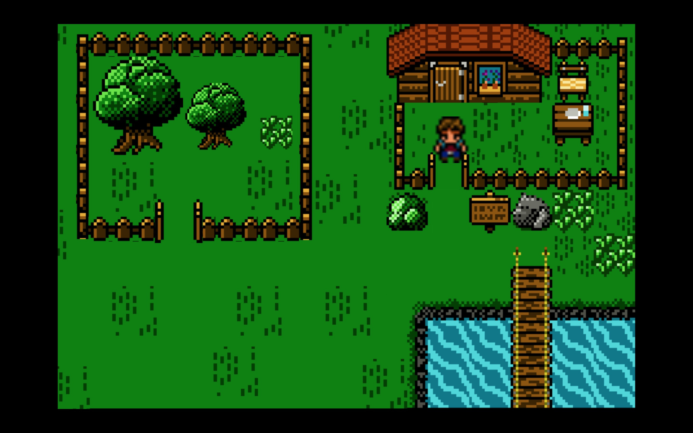
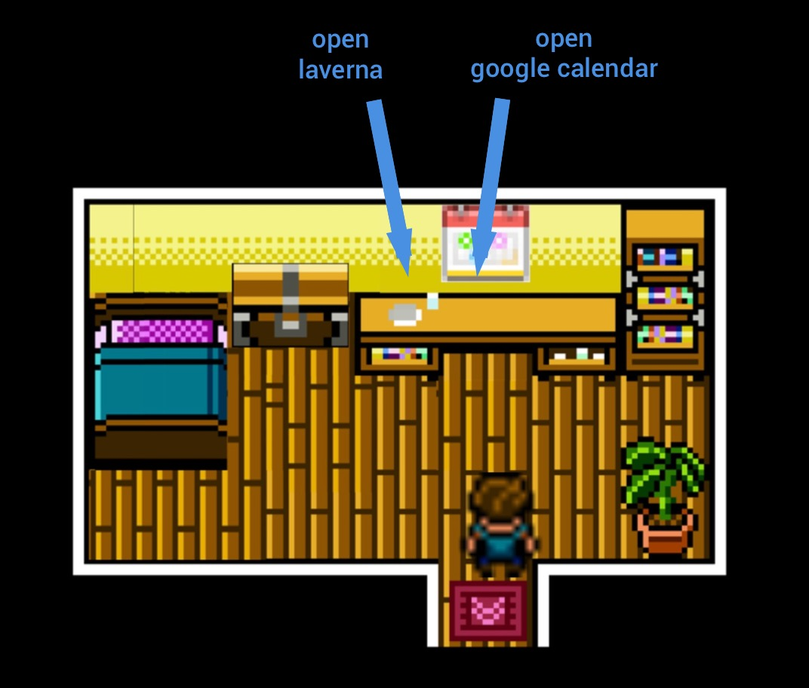

# 8bit
> 8bit is a very simple app. It's basically a 8bit like wrapper to open third party apps.

# Commands
* arrow key to move the character
* press "A" to interact with an object (open app or open door)

# Interactions

